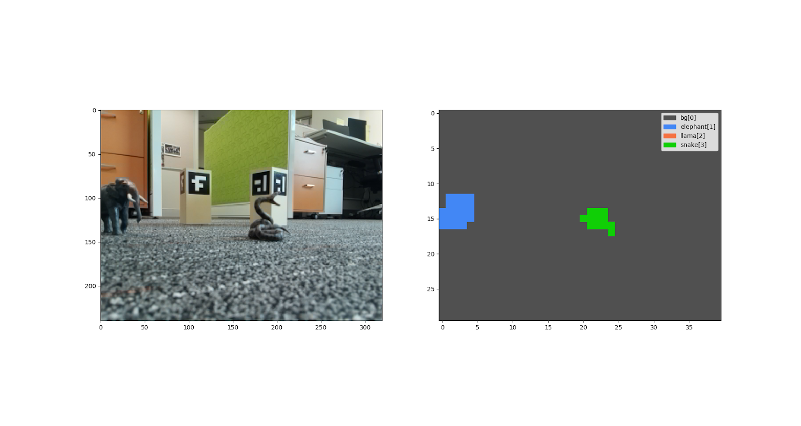

# SlidingWindowDetectionNN

## Intro
The neural network has receives an image and returns a coarse heat map indicating where the animals are.
This NN converts a classification convolutional neural netowork that infers class lables from small image patches to a detection module using 'sliding window' technique. 
The network is *fast to train*. Using the provided small dataset, the network is able to finish training under 10 mins with CPU.

If you want to see the network working, run `python evaluate.py <image path>`
in the network subfolder. For example, `python evaluate.py ./dataset_tools/example_raw_data/252.png`.

To train the CNN, change the hyperparameters listed in `nn_config.yml` and execute `python train.py`

Difficulty Level: Convlutional Neural Network beginners
## Environment:
- opencv
- pytorch
- scipy
- numpy
- matplotlib
- tqdm
- PyYAML
- Pillow

  
